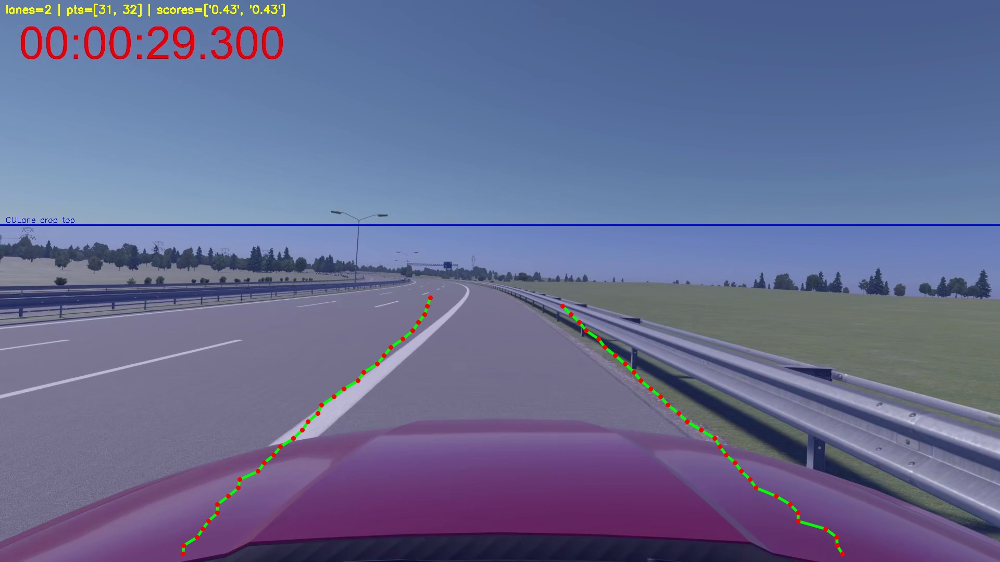
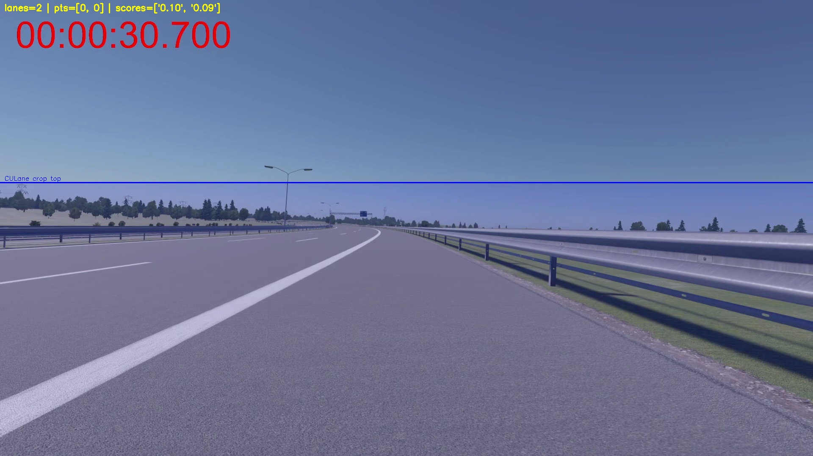

# Lane Detection
Wir verwenden die pyTorch implementierung von ufldv2
https://github.com/cfzd/Ultra-Fast-Lane-Detection-v2?tab=readme-ov-file

---

UFLD (Ultra-Fast Lane Detection) ist ein hochoptimiertes CNN-basiertes Lane-Detection-Modell, das speziell für Echtzeitanwendungen entwickelt wurde.
* kein klassisches Pixel-Segmentation-Masking, sondern ein Anchor-based Regression Modell
* das Bild wird in ein spatiales Grid unterteilt
* Für jede Zeile des Grids schätzt das Modell:
  * Lane-Positionen (x-Koordinaten)
  * Existenzwahrscheinlichkeiten

UFLD liefert also Lane-Vektoren anstelle von Segmentation-Masken.

---

Unsere Anwendung des Lane Detections Modell `LaneDetec.py` ist eine abgewandelte Version von `demo.py` aus dem Original Repo. Bisher wurde es vorallem um eine umfangreiche Debug Funktion ergänzt.
Im aktuellen Zustand zeigt das Debug-Overlay:
* Anzahl der detektierten Lanes
* Anzahl der Punkte pro Lane
* Confidence-Scores
* Visualisierung der Reprojektion
* Blau markierte Crop-Linie für bessere Fehlersuche

Damit lässt sich sehr genau prüfen:
* ob der sichtbare Bildbereich zu klein/groß ist
* ob die Lane-Punkte korrekt rücktransformiert werden
* wie zuverlässig das Modell an verschiedenen Stellen der Strecke arbeitet

## Learnings
Die Trainingdaten (CULane & TuSimple) haben eine sehr ähnliche Fahrerperspektive.
Wenn unsere Simulator-Kamera stark abweicht dann verschlechtern sich die Predictions massiv, selbst wenn die Straße klar erkennbar ist.

Das zurückstrecken der Lanes erfolgt manuell und varriert je nach Perseptive und Kamera Einstellungen (daher sind die folgen Lanes nicht 100% korrekt zurück projeziert)

Die Perspektive scheint am besten zu funktionieren

Diese perspektive funktioniert aber die Motor haube verdeckt einen gutes Stück der Lanes weshalb das Modell dort Probleme hat

Diese Perspektive funktioniert gar nicht.

Alle Dataset liefern Trainingsbilder von einer Dashcam also ungefähr aus Fahrerperspektive. Das letzte Beispiel weicht stark von dieser Perspektive ab weshalb dort das Modell komplett versagt

## ToDo
Aktuell werden Predictions nur für Batch-Input ausgegeben (ein Ordner voller Frames).
Für das autonome System benötigen wir:
* Live-Inference (Bild für Bild)
* Predictions als strukturierte Daten (z. B. JSON / Python Dict)
* Übergabe an das Weltmodell