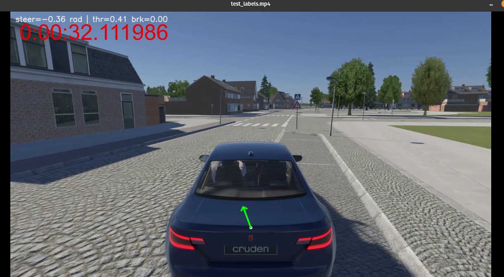
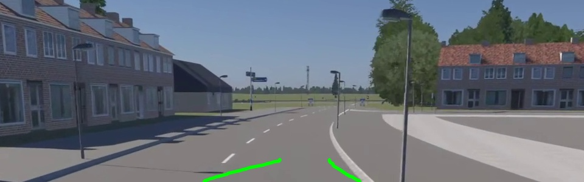

# System Autonomes Fahren (T) – S.A.F.T

Projekt zur Entwicklung eines autonomen Fahrsystems mithilfe des Fahrsimulators der Hochschule Harz.
*(Das „T“ steht aktuell noch offen – Vorschläge sind willkommen!)*

---

## Projektüberblick

Dieses Projekt zielt darauf ab, ein System für **autonomes Fahren im Simulator** zu entwickeln.
Dazu werden Sensordaten (z. B. Kameraaufnahmen und Steuerbefehle) aus dem **Fahrsimulator der Hochschule Harz** verarbeitet und für Trainingszwecke eines neuronalen Netzes aufbereitet.

---

## Tools zur Datenvorverarbeitung

### `create_train_data.py`

* Liest **Videodateien** und die zugehörigen **TabData-CSV-Dateien** aus dem Simulator.
* Synchronisiert beide Quellen und erzeugt:

  * Einzelbilder (`frames/`)
  * Labeldatei (`labels_to_frames.csv`)
* Parameter wie `trim_video_start_sec` oder `sample_stride` können angepasst werden, um Startzeit und Samplingrate zu steuern.

### `crop_finder.py`

* Hilft beim **Bestimmen des passenden Bildausschnitts (Cropping)** für die Trainingsdaten.
* Die Werte des gefunden Crops können ausgeben werden und in `create_train_data.py` verwendet werden
* Praktisch, um irrelevante Teile (z. B. Cockpit oder Himmel) zu entfernen.


### `test_labels.py`

* Visualisiert **Lenkwinkel**, **Throttle** und **Brake** über dem Originalvideo.
* Nutzt das von `create_train_data.py` erzeugte `.csv`.
* Wichtig:

  * `trim_video_start_sec = 0.0`
  * `sample_stride = 1`
    Damit die Label-Zeiten exakt mit den Videoframes übereinstimmen.


---

## Setup & Nutzung

```bash
# Repository klonen
git clone https://github.com/DerNunja/System-Autonomes-Fahren--T-.git
cd System-Autonomes-Fahren--T-

# Virtuelle Umgebung anlegen
python3 -m venv .venv
source .venv/bin/activate

# Abhängigkeiten installieren (sofern requirements.txt existiert)
pip install -r requirements.txt
```

---

## Geplante Erweiterungen

* Integration eines neuronalen Fahrmodells (Behavioural Cloning)
* Online-Synchronisierung mit dem Weltmodell
* Segmentierungsnetzwerke (UFLD / SegFormer)
* MQTT-basierte Kommunikation zwischen Sensorik und Entscheidungslogik
* Web-Interface zur Visualisierung

---

## Mitwirken

Ideen, Verbesserungen oder Namensvorschläge für das **„T“** sind ausdrücklich willkommen!
Erstelle einfach ein Issue oder öffne einen Pull Request.

---

## Resources 


Ultra-Fast-Lane-Detection-v2 pyTorch Implementation (verwendet in ../LaneDetection)
https://github.com/cfzd/Ultra-Fast-Lane-Detection-v2?tab=readme-ov-file


## Lane Detection Issue Example
