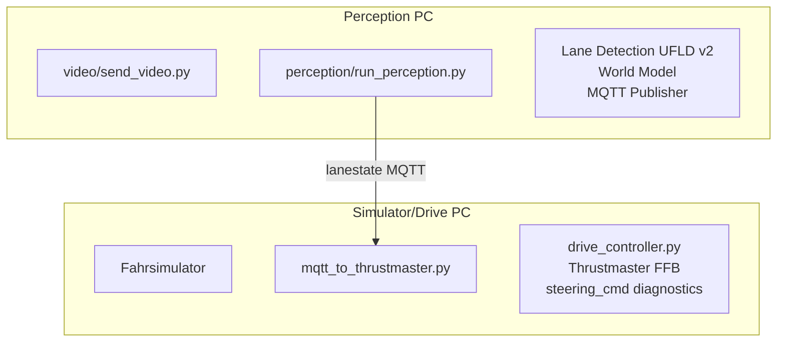

# System Autonomes Fahren (T) - S.A.F.T

Verteiltes, regelbasiertes System für autonomes Fahren im Fahrsimulator der Hochschule Harz.

Das Projekt verarbeitet einen Videostream aus dem Simulator, erkennt Fahrstreifen, erzeugt daraus einen interpretierten Spurzustand und berechnet auf einem separaten Steuerrechner die Lenkbefehle für ein Thrustmaster-Lenkrad. Der aktuelle Stand ist bewusst deterministisch und regelbasiert, nicht Behavioural Cloning.

## Architektur


```mermaid
graph TB
    subgraph PerceptionPC["Perception PC"]
        SendVideo["video/send_video.py"]
        RunPerception["perception/run_perception.py"]
        PerceptionDetails["Lane Detection UFLD v2<br/>World Model<br/>MQTT Publisher"]
    end

    subgraph SimulatorDrivePC["Simulator/Drive PC"]
        Simulator["Fahrsimulator"]
        DriveCtrl["mqtt_to_thrustmaster.py"]
        DriveCtrlDetails["drive_controller.py<br/>Thrustmaster FFB<br/>steering_cmd diagnostics"]
    end

    RunPerception -->|lanestate MQTT| DriveCtrl
```

Die Rollen sind klar getrennt:

- Perception PC: Video empfangen, Fahrstreifen erkennen, Ego-Spurzustand publizieren.
- Drive/Simulator PC: Spurzustand empfangen, Lenkziel berechnen, aktuelles Lenkrad lokal regeln.
- MQTT: Transport für Wahrnehmungsdaten, Steuerdiagnostik und aggregierte Zustaende.
- NDI: Videotransport zwischen Simulator/Videoquelle und Perception PC.

## Module

```text
src/
  video/              Videoquelle und Videotransport
  perception/         Lane Detection, Weltmodell-Anbindung, Lane-State MQTT
  drive/              Lenkregelung und Thrustmaster-/Xbox-Bridges
  World/              Weltmodell und Ego-Spur-Schaetzung
  LaneDetection/      UFLD-v2-Integration
  mqtt/               MQTT-Datenhub
  runtime/            gemeinsame Laufzeit-/Profiling-Helfer
  data/               Aufzeichnungen und verarbeitete Daten
little_helper/        historische/offline Hilfswerkzeuge
```

Wichtige Einstiegspunkte:

- `src/video/send_video.py`: sendet eine Datei oder Live-Kamera als Videostream `Demo`.
- `src/perception/run_perception.py`: erkennt Spuren und publiziert `sensor/lanestate`.
- `src/drive/mqtt_to_thrustmaster.py`: berechnet Lenkung und bewegt das Thrustmaster-Lenkrad.
- `src/mqtt/mqtt_broker.py`: aggregiert `sensor/#` und `control/#` nach `world/state`.

## Voraussetzungen

- Python `>=3.10`
- `uv` für Dependency-Management
- Mosquitto MQTT Broker
- NDI SDK / `visiongraph-ndi`
- CUDA-faehige GPU empfohlen für Lane Detection
- Thrustmaster-Treiber und `pysdl2` auf dem Drive/Simulator PC

Abhaengigkeiten installieren:

```bash
uv sync
```

MQTT Broker starten:

```bash
mosquitto -p 1883
```

## Starten

Alle Python-Kommandos werden aus `src/` gestartet.

Videoquelle starten, falls der Simulator nicht direkt einen Stream liefert:

```bash
cd src
uv run video/send_video.py
```

Perception starten:

```bash
cd src
uv run perception/run_perception.py
```

Drive/Thrustmaster-Steuerung starten:

```bash
cd src
uv run drive/mqtt_to_thrustmaster.py
```

Optionalen MQTT-Datenhub starten:

```bash
cd src
uv run mqtt/mqtt_broker.py
```

Bei Betrieb über zwei Rechner muss `BROKER` im Drive-Skript auf die IP des MQTT-Brokers gesetzt werden.

## MQTT Topics

| Topic | Richtung | Inhalt |
| --- | --- | --- |
| `sensor/lanestate` | Perception -> Drive/MQTT Hub | Ego-Spurzustand: `t_ms`, `has_ego_lane`, `offset_m`, `heading_error_rad`, `curvature_preview`, `quality`, `lane_center`, `curvature` |
| `control/steering_cmd` | Drive -> MQTT Hub/Diagnose | berechneter Lenkbefehl plus Diagnose: `steer_rad`, `steer_norm`, `valid`, `quality`, `wheel_norm`, `target_norm` |
| `world/state` | MQTT Hub -> Diagnose/UI | aggregierter Zustand aus `sensor/#` und `control/#` |

## Dokumentation

- `SETUP.md`: konkrete Startanleitung und Rechneraufteilung
- `codebase-understanding.md`: technische Codebase-übersicht
- `docs.md`: ausformulierte Projektdokumentation

## Entwicklungsstand

Der aktuelle Stand ist ein regelbasierter Prototyp:

- Fahrstreifenerkennung mit UFLD v2
- Weltmodell für Ego-Spur, Offset, Heading und Kruemmungsvorschau
- Stanley-aehnliche Lateralregelung auf dem Drive PC
- physische Lenkradregelung über Thrustmaster Force Feedback
- MQTT-basierte Trennung zwischen Wahrnehmung und Steuerung

Nicht aktueller Fokus:

- Behavioural Cloning
- Training eines eigenen Fahrmodells
- direkter Zugriff auf interne Simulator-Telemetrie waehrend der Fahrt

## Resources

- Ultra-Fast-Lane-Detection-v2 PyTorch Implementation: https://github.com/cfzd/Ultra-Fast-Lane-Detection-v2
